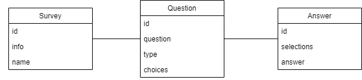
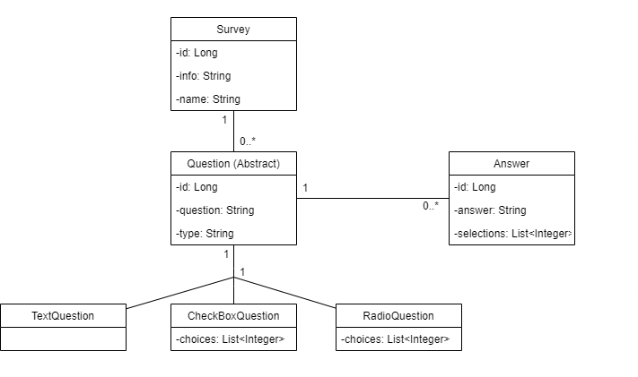
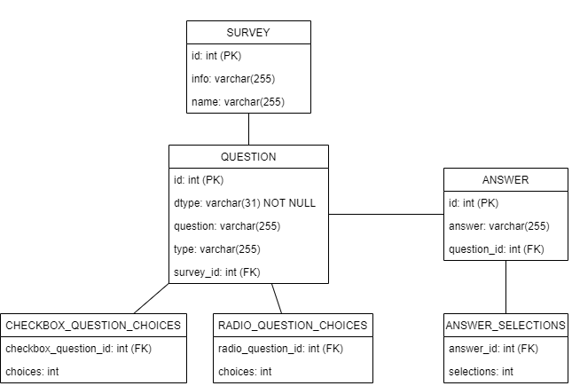

# Kouluprojektissa tehtävän kyselypalvelun backend-toteutus

Projektissa toteutetaan sprinteissä kyselypalvelu, jossa on mahdollista luoda ja hallinnoida kyselyitä backend-puolella sekä vastata kyselyihin Reactilla toteutetulla frontend-puolella.

Sovellus on julkaistuna osoitteessa: https://nopatkotiin-kysely-backend.herokuapp.com/

## Käsitekaavio

## Javakaavio

## Tietokantakaavio

